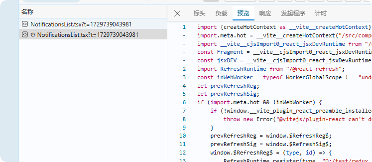
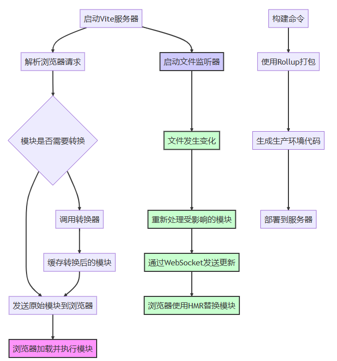

`Vite`热更新流程
<!-- truncate -->
## 前言
*Vite的HMR(热更新)仅限于在开发环境下使用,故以下默认都处于开发环境下。*

**Vite的实现离不开现代浏览器原生支持ESM的特性。**

*当声明一个`script` 标签类型为`module`时,浏览器将对其内部的`import`引用发起`HTTP`请求获取模块内容。获取到内容后再进行执行*

**值得注意的时浏览器只会对用到的模块发起`HTTP`请求,所以`Vite`没有必要对项目里所有文件进行打包,只编译浏览器请求的模块**

## 开发模式下,Vite的工作流程
1. 启动开发服务器,同时创建WebSocket显示开发服务器与浏览器的双向实时通信。
2. 当浏览器通过`HTTP`请求模块时,开发服务器会拦截请求信息,分析出所对应的文件使用`ESBuild`进行编译,并将编译后的内容返回给浏览器。

## HMR的工作流程
- `Vite`的开发服务器会去监听项目文件的变化
- 当文件发生变化时,`Vite`会重新分析受影响的模块,并将这些模块及其依赖使用`ESBuild`重新编译。
- `Vite`开发服务器就会通过`WebSocket`告知浏览器,哪些模块发生了变化,浏览器就会重新加载这些已经重新编译的模块。

