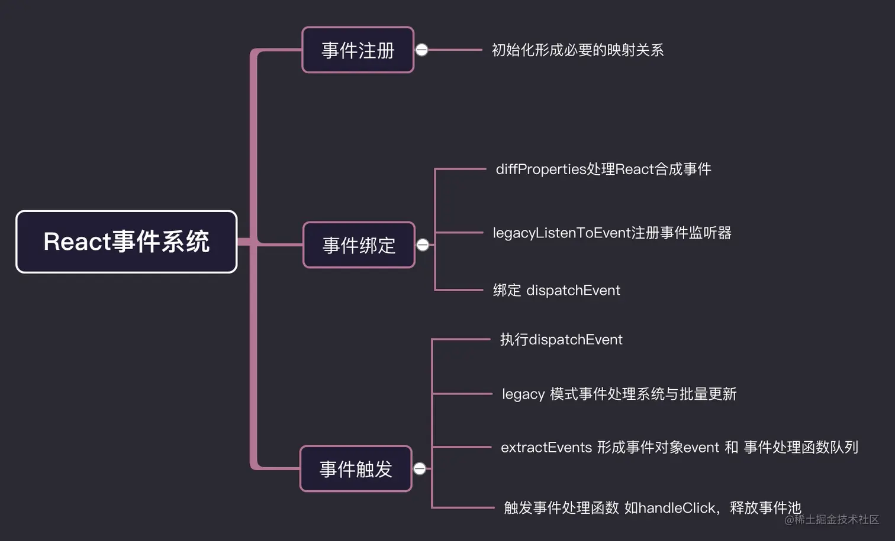
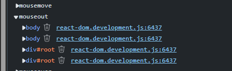

`React`的事件系统
<!-- truncate -->

## 一图流

**Tip : React16及其之前的版本,React17以后已经删除`事件池`**
[仅转载,图片来源:《「react进阶」一文吃透react事件系统原理》](https://juejin.cn/post/6955636911214067720?searchId=2025020614074044F34CB4ABF07AD28EA1)

## Fiber

`Fiber`在`React16`之后引入，其本质是`虚拟DOM`的改良，用于解决递归同步虚拟DOM阻塞所导致的性能问题．在后续的事件流程中，`React`通过事件源对象访问`DOM`从而获取`DOM`对应的`Fiber`节点，收集该节点路径上的同类事件从而模拟事件的冒泡和捕获。

## React合成事件

首先需要明确的是,`React`中我们所编写的类似下面的事件函数并非真正地绑定在`div`的`DOM`上,而是绑定在根节点`root`上。(`React16`及其之前的版本是将事件绑定在`document`上)

```html
<div onClick={()=>{console.log('测试')}}>测试</div>
```



同时还有一点需要注意,我们所写的类似`onClick`等事件也不是所谓的原生事件,而是通过原生事件合成的`React事件`。类似`click`合成`onClick`,`blur`、`change`、`input`、`keydown`、`keyUp`合成为`onChange`

## React额外处理的原因

在讲述`React`如何处理事件系统前,我们还是需要了解一下为什么`React`要做这样的事件。

1. 抹平不同浏览器之间的差异，不同浏览器之间的事件机制并不相同。而`React`自己根据`W3C`规范去实现一套适合`React`机制的事件系统。可以大大减少开发者在浏览器差异上栽跟头。

2. 将所有事件委托至根节点`Root`或者`document`上，可以减少事件监听的数量，优化内存开销。

## 事件注册

```html
<div onClick={()=>{console.log('测试')}}>测试</div>
```

这个`div`节点最终要对应一个`fiber`节点，`onClick`则作为它的`prop`。当这个`fiber`节点进入`render`阶段的`complete`阶段时，名称为`onClick`的`prop`会被识别为事件进行处理。

当绑定事件到root上时,root上的事件监听函数是`listener`,`listener`并不是我们所写的事件处理函数,而是一个`事件监听包装器`,用于分化`事件处理优先级`。

## 事件触发 (事件监听器listener)
`listener`做的事情可以用一句话概括,负责以不同的优先级权重来触发真正的事件流程，并传递事件执行阶段标志（`eventSystemFlags`）---区分`冒泡`和`捕获`执行。

比如一个元素绑定了`onClick`事件，那么点击它的时候，绑定在`root`上的`listener`会被触发，会最终使得组件中的事件被执行。

也就是说绑定到`root`上的事件监听`listener`只是相当于一个传令官，它按照事件的优先级去安排接下来的工作：**事件对象的合成、将节点路径上的事件处理函数收集到执行路径、 事件执行，** 这样在后面的调度过程中，`scheduler`才能获知当前任务的优先级，然后展开调度。

### 创建合成事件对象

`React`内部遵照`W3C`规范去实现一套事件系统，所以它的事件对象和原生事件对象并不相同。而原生的事件对象只不过是它的一个属性（`nativeEvent`）。

```js
  // 构造合成事件对象
  const event = new SyntheticEvent(
    reactName,
    null,
    nativeEvent,
    nativeEventTarget,
    EventInterface,
  );
```

### 收集节点路径上的同类事件处理函数到执行数组中
```html
<div onClick={onClickParent}>
  父元素
  <div onClick={onClickChild}>
     子元素
  </div>
</div>

listeners: [ onClickChild, onClickParent ]
```
`listeners`中就是节点路径上收集到的同类事件处理函数,据事件的冒泡和捕获阶段来决定事件执行的顺序。

如果是冒泡就是从左往右执行，捕获则是从右往左执行。
**`listeners`中的事件处理函数排列顺序不会受冒泡和捕获的影响,冒泡和捕获是通过执行顺序的不同而实现的**


[本文参考文章:《深入React合成事件机制原理》](https://segmentfault.com/a/1190000039108951)
