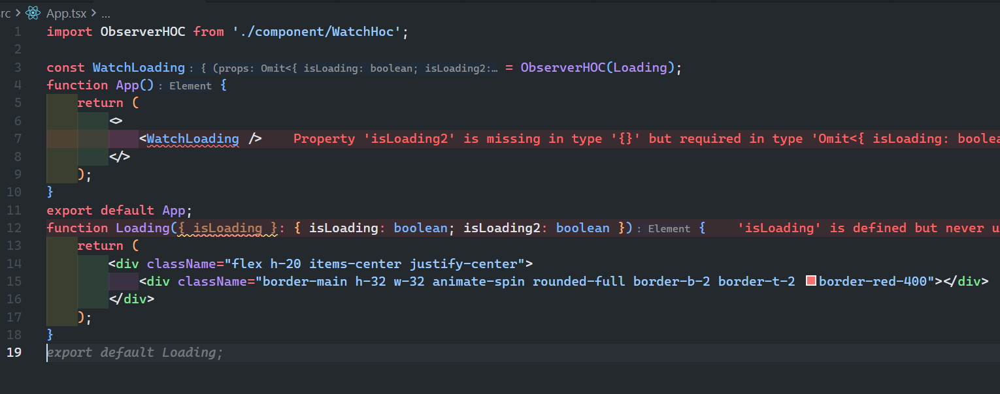

`React高阶组件`
<!-- truncate -->

## 前言

- `HOC高阶组件`本质上是一个函数，往往接收一个`函数组件`并返回一个新的组件，在这个新的组件中对传入的组件进行了一些额外的操作。（即对原来的的组件内容进行补充或者增强）

- 在开发场景中，`HOC高阶组件`往往充当着`工具组件`的角色，他并不`侵入性的影响`原来的组件。基于这个原则，在`HOC`中去组织一些复用性的代码逻辑，从而控制其`子树UI`的渲染。

- 与自定义`Hook`不同，`Hook`只能将我们的代码逻辑抽离到一个地方，但并不能直接影响`UI`的渲染，而是通过`Hook`提供的内容自己去控制视图内容。

## `HOC`的作用(不考虑反向继承，有侵入性影响)

1. 负责补充传递`props`。
2. 直接在`HOC`内部去控制`原有组件`的渲染(不改变`原有组件`的前提下)。

二者并非互斥的关系，`HOC`的核心就是由自己内部执行特定逻辑从而影响、控制`原有组件`的内容。

## 代码示例

**首先确定我们的目的，实现一个元素在出现可视窗口内就显示`Loading加载UI`，当元素不在可视窗口内就隐藏内容。** 应用场景常见于下拉分页查询。

1. 补充`Props`：

```tsx
import { ComponentType, useEffect, useMemo, useRef, useState } from 'react';

function ObserverHOC<P>(Component: ComponentType<P>) {
    const WrappedComponent = (props: Omit<P, 'isLoading'>) => {
        const domRef = useRef<HTMLDivElement>(null);
        const [isVisible, setIsVisible] = useState(false);
        const observer = useMemo(() => {
            return new IntersectionObserver(entries => {
                entries.forEach(entry => {
                    if (entry.isIntersecting) {
                        setIsVisible(true);
                    } else {
                        setIsVisible(false);
                    }
                });
            });
        }, []);
        useEffect(() => {
            const dom = domRef.current;
            if (dom) {
                observer.observe(dom);
            }
            return () => {
                if (dom) {
                    observer.unobserve(dom);
                }
            };
        }, [observer]);
       return <div ref={domRef}>{<Component {...(props as P & JSX.IntrinsicAttributes)} isLoading={isVisible} />}</div>;
    };
    WrappedComponent.displayName = `ObserverHOC(${Component.displayName || Component.name || 'Component'})`;
    return WrappedComponent;
}

export default ObserverHOC;
```

这部分代码示例中，`ObserverHOC`通过`useRef`以及`IntersectionObserver`去判断组件元素是否进入了可视窗口内（`isVisible`）,从而去并将`isVisible`传递给子组件。

```tsx
 const WrappedComponent = (props: Omit<P, 'isLoading'>) =>{..........}
```

则是约束我们包装后返回的新组件不再需要我们去传递`isLoading`了，因为`ObserverHOC`内部已经处理了。


如果你漏传了`Props`，react也能提供相应的类型提示。



当然，这样需要你确定`HOC`本身传递的`Props`的类型和字段，保证其被包装的组件能够正确接收到。

2. 控制`原有组件`的渲染(不改变`原有组件`的前提下)：

```tsx
import { ComponentType, useEffect, useMemo, useRef, useState } from 'react';

function ObserverHOC<P>(Component: ComponentType<P>) {
    const WrappedComponent = (props: P) => {
        const domRef = useRef<HTMLDivElement>(null);
        const [isVisible, setIsVisible] = useState(false);
        const observer = useMemo(() => {
            return new IntersectionObserver(entries => {
                entries.forEach(entry => {
                    if (entry.isIntersecting) {
                        setIsVisible(true);
                    } else {
                        setIsVisible(false);
                    }
                });
            });
        }, []);
        useEffect(() => {
            const dom = domRef.current;
            if (dom) {
                observer.observe(dom);
            }
            return () => {
                if (dom) {
                    observer.unobserve(dom);
                }
            };
        }, [observer]);
        return <div ref={domRef}>{isVisible && <Component {...(props as P & JSX.IntrinsicAttributes)} />}</div>;
    };
    WrappedComponent.displayName = `ObserverHOC(${Component.displayName || Component.name || 'Component'})`;
    return WrappedComponent;
}

export default ObserverHOC;

```

这个例子,`HOC`不对原有组件进行任何操作，只是在原有组件的基础上，通过`isVisible`去控制其渲染。


## 总结

为了在使用`HOC`包装组件后依然能提供良好的`TS`推导，核心点就是`ComponentType<P>`泛型`P`接收原有组件类型，在返回的新组件中,对`Props`进行约束或者不改变。在`JSX`中使用类型断言去解决`props`的类型问题。
