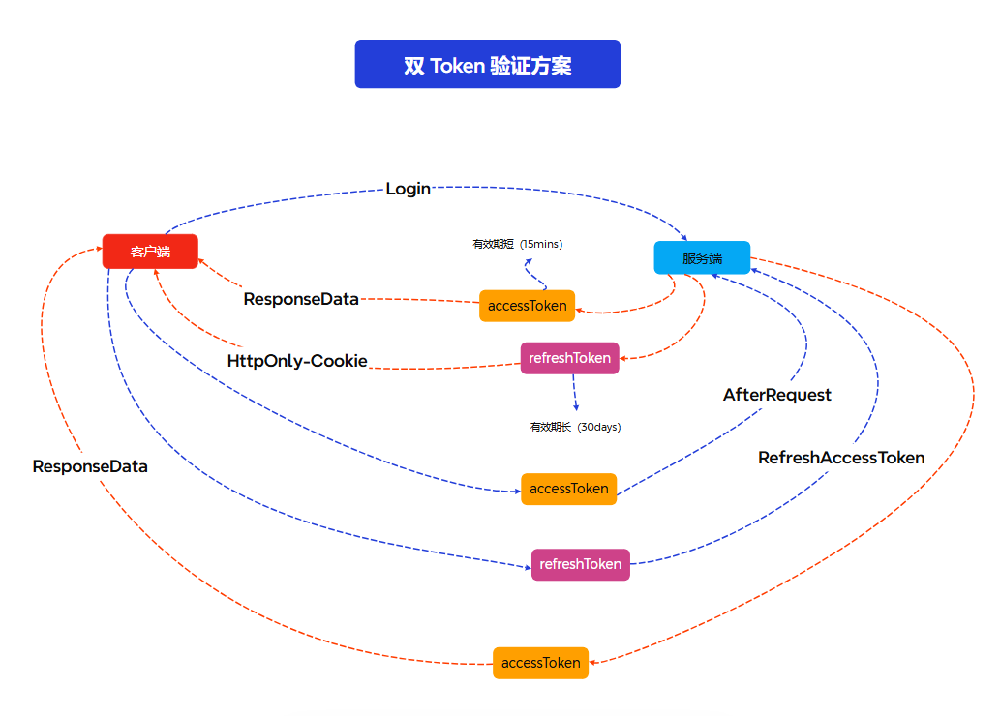

使用双重`Token`验证的用户验证方案。
<!-- truncate -->

## 前言
在之前的项目中，我基本都是围绕`JWT`去做用户校验。`JWT`天然的无状态方案不需要我们专门在服务端去维护`Session`表，也不需要我们去做`Session`的同步，只需要在客户端存储`Token`，然后在请求时携带`Token`即可，相当的简便。

但这带来一个问题，在`JWT`中，我们无法在服务端主动去`销毁Token`，因为`Token`是无状态的，无法在服务端去维护`Token`的状态。即使用户在客户端进行了登出操作，但如果拿到之前的`Token`放到请求头依然能够正常请求。虽说这对于一般的用户进行正常操作来说是没有什么影响的，但是在浏览器`Token`是完全暴露的情况下，这就会带来一个安全问题。尤其是简单地使用`JWT`作为登陆凭证往往会设置较长的过期时间，那么在这段时间内，一旦有人窃取拿到了`Token`，就可以一直使用这个`Token`进行操作，这就会带来很大的安全隐患。


## 解决思路

### 使用`Refresh Token`
首先是`JWT`一般过期时间都比较长的问题，可以通过缩短`Token`的过期时间来解决。但这又带来了一个新的问题，那就是`Token`过期后，用户需要重新登录。这就会导致用户体验非常差，用户需要重新登录，然后重新输入密码，重新输入验证码等等。这就会导致用户体验非常差，用户需要重新登录，然后重新输入密码，重新输入验证码等等。

这时候我们可以使用两个`Token`去解决这个问题。一个有效期短的`Token`作为登录凭证，一个有效期长的`Token`作为刷新凭证。当用户登录成功后，服务端会返回两个`Token`，一个作为登录凭证，一个作为刷新凭证。当用户登录凭证过期后，服务端会返回一个新的登录凭证和一个新的刷新凭证。这样就可以解决`Token`过期后，用户需要重新登录的问题。

这样即使真正的`验证Token`有效期短，也可以通过长时效的`Refresh Token`来无感刷新`验证Token`，无需用户重新登陆。而且由于真正的`验证Token`有效期短，大大缩短了使用非法获取的`Token`进行非法操作的窗口时间。

- `刷新Token` 有效期长，用于刷新`验证Token`  由服务端通过`httponly-cookie`回传给客户端

- `验证Token` 有效期短，用于验证用户身份  由服务端通过`JSON`数据回传，由客户端存储在`sessionStorage`或者直接存储在运行内存中

### 黑名单
维护一个黑名单，用于存储主动失效的`刷新Token`。

在用户登出时，服务端将用户的`刷新Token`加入到黑名单中并清除其对应的`cookie`，这样用户不得不重新登录。即便用户通过某种手段使用之前的`刷新Token`去获取新的`验证Token`，也会因为黑名单的存在而无法获取到新的`验证Token`。

## 代码示例

### 前端部分
```TS
const axiosInstance = axios.create({
    baseURL: '/api'
});

//无需任何处理的接口
const noCheckRequestList: string[] = ['/auth/register', '/auth/login', '/auth/refresh-accessToken', '/auth/logout'];

//请求处理
axiosInstance.interceptors.request.use(async (config: InternalAxiosRequestConfig & IRequestConfig) => {
    try {
        // 不进行任何处理的接口
        if (noCheckRequestList.includes(config.url || '')) {
            return config;
        } else {
            // 处理验证token
            let accessToken = getAccessToken();

            if (!accessToken) {
                accessToken = await refreshAccessToken();
            }

            config.headers['Authorization'] = `Bearer ${accessToken}`;

            return config;
        }
    } catch (e: any) {
        return Promise.reject(e);
    }
});

//响应处理
axiosInstance.interceptors.response.use(
    // 响应成功回调
    async (response: IResponseParams<IResponse, any>) => {
        try {
            const { data } = response;

            // 服务端成功响应了数据,但是业务结果是失败的
            if (!data.success) {
                throw new Error(data.message);
            }

            return response;
        } catch (e: any) {
            const toastError = response.config.toastError ?? true;

            if (toastError) {
                toast.error(e instanceof Error ? e.message : e);
            }

            return Promise.reject(e);
        }
    },
```
以`axois`封装网络请求举例，在接口请求前，我们需要将`验证Token`放入自定义请求头中。

同时我们还需要区分哪些接口是不需要这些处理。常规的比如登录、接口一般不需要我们去做用户登录状态拦截。

响应成功的回调(状态码:`2XX`)就没什么好说的，很常规的业务错误判断以及错误信息提示。

```TS
 //响应失败回调
    async error => {
        const originalRequest = error.config;

        // 判断是否因为token过期导致失败（还要判断是否为重试请求以及是否需要进行token检查）
        if (error.response?.status === 401 && !originalRequest._retry && !noCheckRequestList.includes(originalRequest.url || '')) {
            //标记为重试请求（再失败直接判断非法错误）
            originalRequest._retry = true;
            const newAccessToken = await refreshAccessToken();

            originalRequest.headers['Authorization'] = `Bearer ${newAccessToken}`;

            return axiosInstance(originalRequest);
        }

        return Promise.reject(error);
    }
```
响应失败回调就需要我们注意了，因为我要在这里去判断`失败原因`以及是否为`重试请求`

假设一个服务器返回了失败响应，我们首先判断是不是`401`(认证错误)，以及这次请求是否已经被标记为`重试请求`(`_retry`)，同时还需要判断响应错误的接口是否在无需处理的列表中。

通过这些判断去分析这个请求是否在`刷新Token没有过期的情况下，没有验证Token或者验证Token过期的情况下导致响应失败`

如何真是这样导致请求失败，我们将该请求标识为`重试请求`，同时重新获取`验证Token`(`refreshAccessToken`)并放到请求头上重新请求。

如果还是失败，那我们可以认为服务端出现了问题，或者该用户的信息出现异常导致了失败。不再重新尝试请求。

```TS
// 刷新accessToken
async function refreshAccessToken() {
    try {
        const response = await axiosInstance.get('/auth/refresh-accessToken');
        const {
            data: { data: accessToken = '' }
        } = response;

        if (!accessToken || response.status === 401) {
            logout();
        }

        saveAccessToken(accessToken);

        return accessToken as string;
    } catch (error) {
        // refreshToken cookie 过期了，直接注销重新登录
        toast.error('登录信息已过期，请重新登录');
        removeAccessToken();
        window.location.href = '/login';

        return Promise.reject(error);
    }
}
```
这是获取`验证Token`的代码。

由于我们的`刷新Token`在`cookie`上，所以我们不需要像`验证Token`一样自己放入到自定义请求头中。

如果服务端返回错误响应或者没有有效的`刷新Token`，我们就认为现在的`刷新Token`已经过期了或者不存在。手动执行注销操作，清除客户端的所有验证信息。

### 服务端部分

```ts
//注册
const register = RequestHandler(async (req, res) => {
    const { name, email, password }: { name: string; email: string; password: string } = req.body;

    const user = await findUser({ email });

    if (user) {
        throw new UnauthorizedError('邮箱已注册');
    }

    const passwordHash = await bcrypt.hash(password, 10);

    await addUser({ name, email, passwordHash });

    return res.json(responseBody(true, '注册成功'));
});

// 登录
const login = RequestHandler(async (req, res) => {
    const { email, password }: { email: string; password: string } = req.body;

    const user = await findUser({ email });

    if (!user || !(await bcrypt.compare(password, user.passwordHash))) {
        throw new UnauthorizedError('用户名或密码错误');
    }

    const payload: UserPayload = {
        id: user.id,
        name: user.name,
        email: user.email,
        avatarUrl: user.avatarUrl,
        roles: user.roles
    };

    const accessToken = generateAccessToken(payload);
    const refreshToken = generateRefreshToken(payload);

    res.cookie('refresh_token', refreshToken, { httpOnly: true, secure: true, sameSite: 'strict' });

    return res.json(
        responseBody(true, '获取Token', {
            data: accessToken
        })
    );
});

// 登出
const logout = RequestHandler(async (req, res) => {
    const refreshToken = req.cookies.refresh_token as string;

    if (!refreshToken) {
        throw new UnauthorizedError('无刷新令牌');
    }

    res.clearCookie('refresh_token');
    const expiresAt = getJwtExpiry(refreshToken);

    if (expiresAt && Date.now().valueOf() > expiresAt) {
        const parsedData = blackListInsertValidation.parse({
            token: refreshToken,
            expiresAt: new Date(expiresAt)
        });

        await db.insert(blackList).values(parsedData);

    }

    return res.json(responseBody(true, '退出成功'));
});
```

常规的登录注册，只不过`登录`需要生成两个 `token` 一个通过`cookie`回传给客户端，另一个直接通过`json`数据返回，由客户端去处理存储。

`登出`操作先清除`refresh_token`，再去获取`token`过期时间去判断是否需要加入黑名单；

```ts
// 用户身份验证中间件
const authenticateToken = RequestHandler((req, res, next) => {
    const authHeader = req.headers['authorization'];
    const token = authHeader && authHeader.split(' ')[1];

    if (!token) {
        throw new UnauthorizedError('缺少认证令牌');
    }

    const user = verifyToken(token) as UserPayload;

    if (!validatorNoEmpty(user)) {
        throw new UnauthorizedError('无效的认证令牌');
    }

    // 将用户信息附加到请求对象上
    req.user = user;
    next();
});

// 验证身份状态
const validateAuth = RequestHandler(async (req, res) => {
    const user = req.user;

    if (!user || !user.id || !user.email) {
        throw new UnauthorizedError('无效的令牌');
    }

    const result = await findUser({
        id: user.id,
        email: user.email
    });

    if (!result) {
        throw new UnauthorizedError('用户不存在');
    }

    return res.json(responseBody(true, '验证成功', { data: user }));
});

// 刷新令牌
const refreshToken = RequestHandler(async (req, res) => {
    const refreshToken = req.cookies.refresh_token as string;

    if (!refreshToken || (await isTokenBlacklisted(refreshToken))) {
        throw new UnauthorizedError('无效的刷新令牌');
    }

    const decodedToken = verifyToken(refreshToken) as RefreshPayload;

    if (!decodedToken) {
        throw new UnauthorizedError('令牌过期');
    }

    // 获取用户
    const user = await findUser({
        id: decodedToken.id
    });

    if (!user) {
        throw new UnauthorizedError('用户不存在');
    }

    const newAccessToken = generateAccessToken(user);

    return res.json(responseBody(true, '刷新Token', { data: newAccessToken }));
});
```

用户身份验证中间件的逻辑就是解析`jwt`载荷的用户信息，挂在`req`上，让后续的逻辑的直接使用上。

`validateAuth`就是根据`jwt`信息检查是否存在该用户、验证其身份。

`refreshToken` 就是通过验证后的`刷新Token`拿到信息去检索该用户，使用用户数据去重新生成一个新`Token` 


## 思维导图

