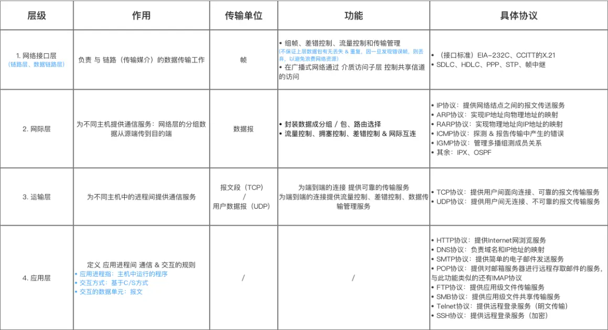

# 计算机网络概述
本文对计算机网络仅作为基本概述，主要介绍面向前端开发者而言最基本的计算机网络知识。

## 网络模型(TCP/IP)
这里仅介绍较为易于理解的TCP/IP模型。该模型分为四层，分别为
- 应用层(Application Layer)：为用户提供应用服务，如HTTP、FTP、SMTP等。
- 传输层(Transport Layer)：为应用层提供端到端的通信，如TCP、UDP等。
- 网际层(Network Layer)：为传输层提供网络间的通信，如IP、ICMP等。
- 网络接口层(Data Link Layer)：为网络层提供数据包的传输，如Ethernet、PPP等。


## 常见协议(不一定属于同一层)
- **HTTP：超文本传输协议，用于传输超文本文档。**
- **HTTPS：HTTP协议的安全版本，用于加密传输。**
- FTP：文件传输协议，用于传输文件。
- SMTP：简单邮件传输协议，用于发送邮件。
- **DNS：域名系统，用于域名解析。**
- **TCP：传输控制协议，用于实现端到端的通信。**
- **UDP：用户数据报协议，用于实现点对点的通信。**
- IP：网际协议，用于实现网络间的通信。
- ICMP：互联网控制消息协议，用于网络诊断。
- ARP：地址解析协议，用于获取IP地址对应的MAC地址。
- DHCP：动态主机配置协议，用于自动分配IP地址。
- PPP：点对点协议，用于建立点对点的通信。
- Ethernet：以太网，用于数据包传输。
- WiFi：无线局域网，用于无线通信。

## 计算机网络中的各级地址
- **域名**：直接面向操作用户的网站地址，比如```www.baidu.com```，需要通过DNS解析转换成IP地址。
- **DNS**：域名系统，它用于将我们输入的域名转换成IP地址，帮助我们找到服务器的具体地址。
- **IP地址**：网络层地址，用于识别设备的位置。如今分为 IPV4 和 IPV6。
- **MAC地址**：数据链路层的物理地址，唯一标识网络设备，用于在局域网中识别设备。

### 域名
域名是存在层级结构，从右往左分级
以```www.baidu.com```为例
- **根域名**： ```.```默认省略
- **顶级域名**：```.com``` 是域名的最右部分。还有诸如 .cn、.top等其他顶级域名
- **二级域名**：紧跟着顶级域名```.baidu```
- **子域名**：```www```二级域名前还可以有一个子域名，提供更多可访问的域名地址